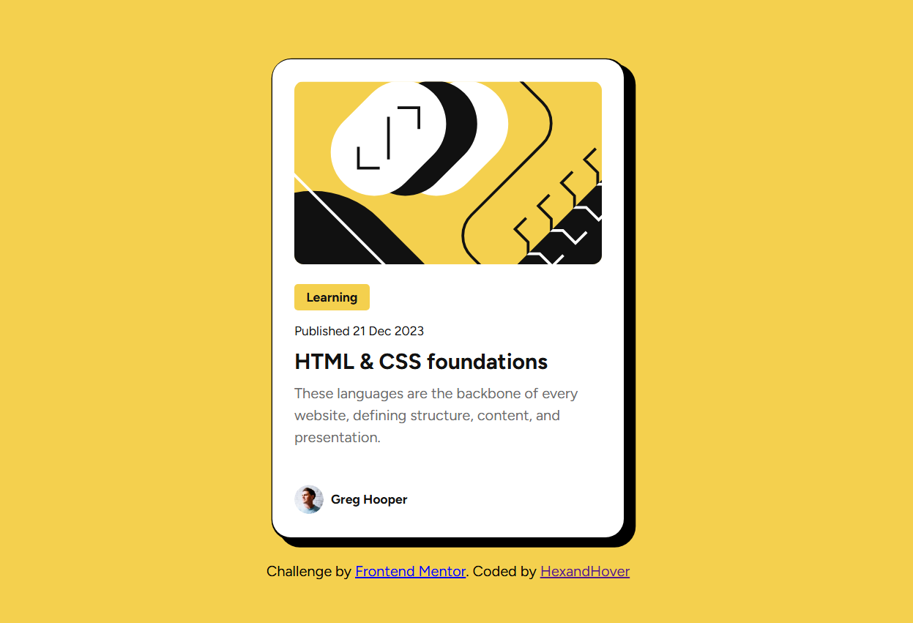

# Frontend Mentor - Blog preview card solution

This is a solution to the [Blog preview card challenge on Frontend Mentor](https://www.frontendmentor.io/challenges/blog-preview-card-ckPaj01IcS). Frontend Mentor challenges help you improve your coding skills by building realistic projects. 

## Table of contents

- [Overview](#overview)
  - [The challenge](#the-challenge)
  - [Screenshot](#screenshot)
  - [Links](#links)
  - [My process](#my-process)
  - [Built with](#built-with)
  - [What I learned](#what-i-learned)
  - [Continued development](#continued-development)
  - [Useful resources](#useful-resources)
- [Author](#author)

**Note: Delete this note and update the table of contents based on what sections you keep.**

## Overview

### The challenge

Users should be able to:

- See hover and focus states for all interactive elements on the page

### Screenshot

### Links

- Solution URL: https://www.frontendmentor.io/solutions/blog-preview-card-css-81bqujCXnQ
- Live Site URL: https://hexandhover.github.io/blog-preview-card-main/

## My process
  I started building this after getting frustrated with a javascript tutorial. It was like arriving to a flower field after slaying 500 goblin.
  Now i am struggling with font family. WHY EVERYTHING IS SO COMPLICATED?
  i realized i already changed the font. I was searching for 30minutes for nothing. GREAT.
  I just realized i need 'font name' at least my search didn't go to waste.
  I searched the difference between margin and padding. Still don't get it. 
  i am so close to delete everything and start over.
  i did it.
  I added variables. I am leveling up.
  i have no idea how box shadow works.
  IT'S DONE!
  oh i forgot the hover. Right.
  I am finally done. 
  Now i have a totally new battle ahead of me... Adding this to github.

### Built with

- Semantic HTML5 markup
- CSS custom properties
- Flexbox

### What I learned

I learned how to use google fonts after struggling for long minutes.
I learned variables
I learned the importance of naming classes and ids well.

<h1>Some CSS code I'm proud of</h1>
:root {
  --yellow: hsl(47, 88%, 63%);
  --white: hsl(0, 0%, 100%);
  --gray-500: hsl(0, 0%, 42%);
  --gray-950: hsl(0, 0%, 7%);
  --primary-font: "Figtree",sans-serif;
  --preset-1: 24px;
  --preset-2:  16px;
  --preset-3: 14px;
}

### Continued development

I need to practice margins and paddings urgently.
Maybe i can start using rem instead of px for accesibility.
I still don't know how to code the mobil.

### Useful resources

- My dear friend chatgpt for showing me the ; and : i forgot to add

## Author

- Frontend Mentor - [@hexandhover](hhttps://www.frontendmentor.io/profile/hexandhover)
- Twitter - [@hexandhover](https://www.twitter.com/yourusername)
